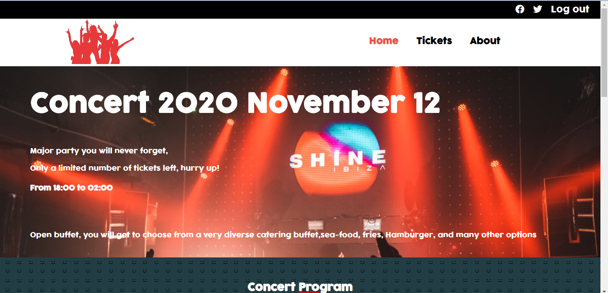
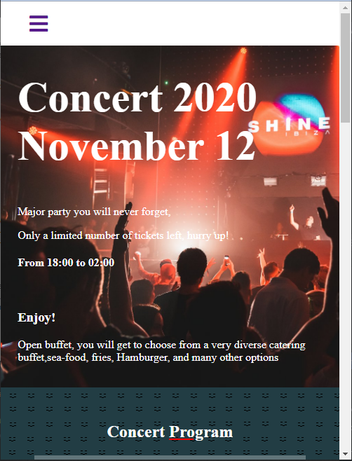

# Concert Website Project
Concert website is a site for a conceptual event, it is a solo project accomplished to satisfy Microverse capstone requirement. I would like through this work to demonstrate mastery in HTML, CSS in addition to skills in other important aspects like good UI design..

# Screenshot

# Live Demo
[Live Demo Link](https://rayan84.github.io/concert/)

# Video Presentation
[Presentation](https://youtu.be/-jM_NNjVRp4)

# Built With
* CSS
* HTML
* JavaScript

# Authors

## Rayan Rassam
* Github:[@Rayan84](https://github.com/Rayan84)
* Twitter:[@Rayan65096267](https://twitter.com/Rayan65096267)
* LinkedIn:[@rayan rassam](https://www.linkedin.com/in/rayan-rassam-18a0a426/)

## Contributing
Contributions, issues and feature requests are welcome!
Feel free to check the [Issue](https://github.com/Rayan84/Apple-website-webpage-clone/issues) and help me improve!
